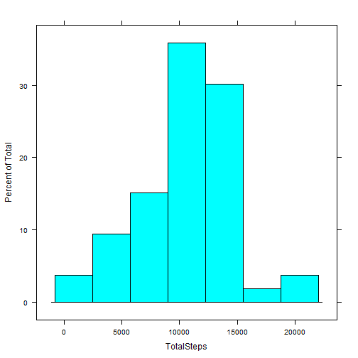
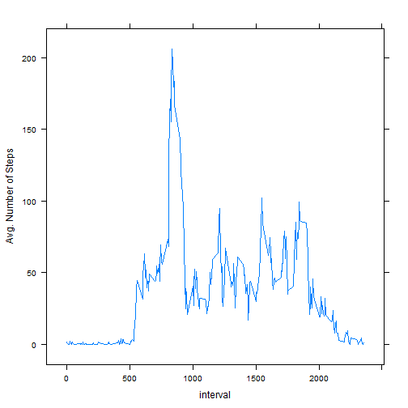
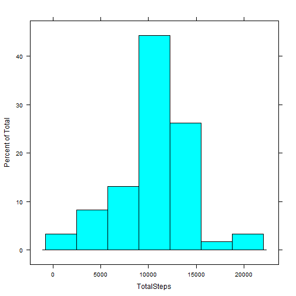

# Reproducible Research: Peer Assessment 1

In this project, we are perfroming explatory data analysis on personal activity data recorded by a personal activity monitoring device.

## Loading and preprocessing the data

First, we need to load the data. It is assumed that the data is in the current working directory.


```r
activityData <- read.csv("activity.csv")
names(activityData)
```

```
## [1] "steps"    "date"     "interval"
```

```r
library(lattice)
```

```
## Warning: package 'lattice' was built under R version 3.0.3
```


## What is mean total number of steps taken per day?

Before, we make any calculations, note that NA values are omitted first.


```r
completeActivityData <- activityData[!is.na(activityData$steps), ]
dim(completeActivityData)
```

```
## [1] 15264     3
```

```r
dim(activityData)
```

```
## [1] 17568     3
```


In order to find mean and median or before plotting histogram, first, we need to aggregate the number of steps per day.


```r
totalStepsPerDay <- aggregate(completeActivityData$steps ~ completeActivityData$date, 
    data = completeActivityData, sum)
names(totalStepsPerDay) <- c("date", "TotalSteps")
```


Now, we are ready to plot the histogram.


```r
histogram(~TotalSteps, totalStepsPerDay)
```

 


We can easily calculate the mean total number of steps taken per day by mean function,


```r
mean(totalStepsPerDay$TotalSteps)
```

```
## [1] 10766
```


By the same vein, we can easily calculate the median total number of steps taken per day.


```r
median(totalStepsPerDay$TotalSteps)
```

```
## [1] 10765
```


Please note that median and mean are close to each other but not the same.

## What is the average daily activity pattern?

To determine the daily activity pattern, let's take a look at a time series plot of the 5-minute interval (x-axis) and the average number of steps taken, averaged across all days (y-axis).


```r
avgStepsPerDay <- aggregate(completeActivityData$steps ~ completeActivityData$interval, 
    data = completeActivityData, mean)
names(avgStepsPerDay) <- c("interval", "AvgSteps")
xyplot(AvgSteps ~ interval, data = avgStepsPerDay, type = "l", ylab = "Avg. Number of Steps")
```

 


It is easy to detmine at which interval the maximum average steps is observed.


```r
avgStepsPerDay[avgStepsPerDay$AvgSteps == max(avgStepsPerDay$AvgSteps), ]
```

```
##     interval AvgSteps
## 104      835    206.2
```


One can easily determine that the maximum average number of steps occurs around lunch time. After that we see more activity in the afternoon hours and then it dies down, as it represents the sleep time.

## Imputing missing values

To further our analysis, we are going to replace the NA values in the activity data by average number of steps taken in that particular day.To do so, we are adding another column to the original activity data. In that new column we have average number of steps taken for that particular day. Then, we replace the NA values with the value present in that new column (AvgSteps).


```r
sum(is.na(activityData$steps))
```

```
## [1] 2304
```

```r
mergedData <- merge(activityData, avgStepsPerDay, all = T)
head(mergedData)
```

```
##   interval steps       date AvgSteps
## 1        0    NA 2012-10-01    1.717
## 2        0     0 2012-11-23    1.717
## 3        0     0 2012-10-28    1.717
## 4        0     0 2012-11-06    1.717
## 5        0     0 2012-11-24    1.717
## 6        0     0 2012-11-15    1.717
```

```r
tail(mergedData)
```

```
##       interval steps       date AvgSteps
## 17563     2355     0 2012-10-16    1.075
## 17564     2355     0 2012-10-07    1.075
## 17565     2355     0 2012-10-25    1.075
## 17566     2355     0 2012-11-03    1.075
## 17567     2355    NA 2012-10-08    1.075
## 17568     2355    NA 2012-11-30    1.075
```

```r
for (i in 1:nrow(mergedData)) {
    if (is.na(mergedData$steps[i])) {
        mergedData$steps[i] <- mergedData$AvgSteps[i]
    }
}
head(mergedData)
```

```
##   interval steps       date AvgSteps
## 1        0 1.717 2012-10-01    1.717
## 2        0 0.000 2012-11-23    1.717
## 3        0 0.000 2012-10-28    1.717
## 4        0 0.000 2012-11-06    1.717
## 5        0 0.000 2012-11-24    1.717
## 6        0 0.000 2012-11-15    1.717
```

```r
tail(mergedData)
```

```
##       interval steps       date AvgSteps
## 17563     2355 0.000 2012-10-16    1.075
## 17564     2355 0.000 2012-10-07    1.075
## 17565     2355 0.000 2012-10-25    1.075
## 17566     2355 0.000 2012-11-03    1.075
## 17567     2355 1.075 2012-10-08    1.075
## 17568     2355 1.075 2012-11-30    1.075
```


After, imputing missing values, we can again calculate mean and median and look at the histogram.


```r
totalStepsPerDayNAReplaced <- aggregate(mergedData$steps ~ mergedData$date, 
    data = mergedData, sum)
names(totalStepsPerDayNAReplaced) <- c("date", "TotalSteps")
mean(totalStepsPerDayNAReplaced$TotalSteps)
```

```
## [1] 10766
```

```r
median(totalStepsPerDayNAReplaced$TotalSteps)
```

```
## [1] 10766
```

```r
histogram(~TotalSteps, totalStepsPerDayNAReplaced)
```

 


As one can see, after imputing NA values with mean number of steps for that specific day, the median and mean are the same.

## Are there differences in activity patterns between weekdays and weekends?

Now let's look at the patterns of weekdays and weekends. To do so, we need to create a new variable to identify weekdays and weekend days. 


```r
for (i in 1:nrow(mergedData)) {
    if (weekdays(as.Date(mergedData$date[i], format = "%Y-%m-%d")) == "Saturday" | 
        weekdays(as.Date(mergedData$date[i], format = "%Y-%m-%d")) == "Sunday") {
        mergedData$AvgSteps[i] <- "Weekend"
    } else {
        mergedData$AvgSteps[i] <- "Weekday"
    }
}
n <- names(mergedData)
n[4] <- "Day"
names(mergedData) <- n
```


Before we plot the time series of average number of steps per interval, we need to calculate average number of steps per interval for each day type (i.e., weekend or weekday).


```r
avgStepsPeeWeekAndEndDay <- aggregate(mergedData$steps ~ mergedData$interval + 
    mergedData$Day, data = mergedData, mean)
names(avgStepsPeeWeekAndEndDay) <- c("interval", "Day", "AvgSteps")
```


Now, we are ready to take a look at the time series plot of the 5-minute interval (x-axis) and the average number of steps taken, averaged across all days (y-axis) for each day type (weekend or weekday).


```r
xyplot(AvgSteps ~ interval | Day, data = avgStepsPeeWeekAndEndDay, ylab = "Number of Steps", 
    layout = c(1, 2), type = "l")
```

 


There is a clear difference between weekday and weekend in terms of activity. We don't see that jump in activity around lunch time we observe for weekdays during weekends. It appears that activity is higher during weekend, but spread around all day. On the other hand, the activity is clumped around lunch time for weekdays.
